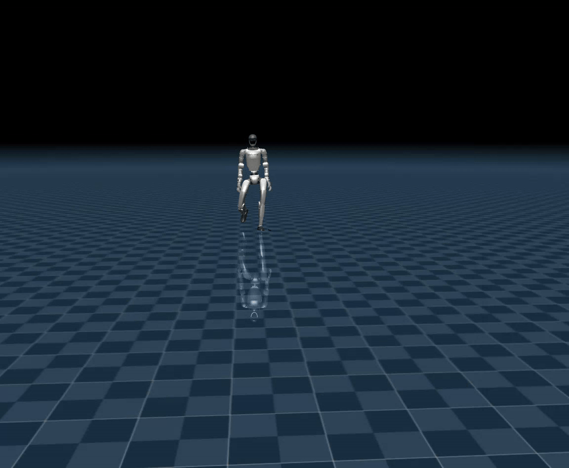
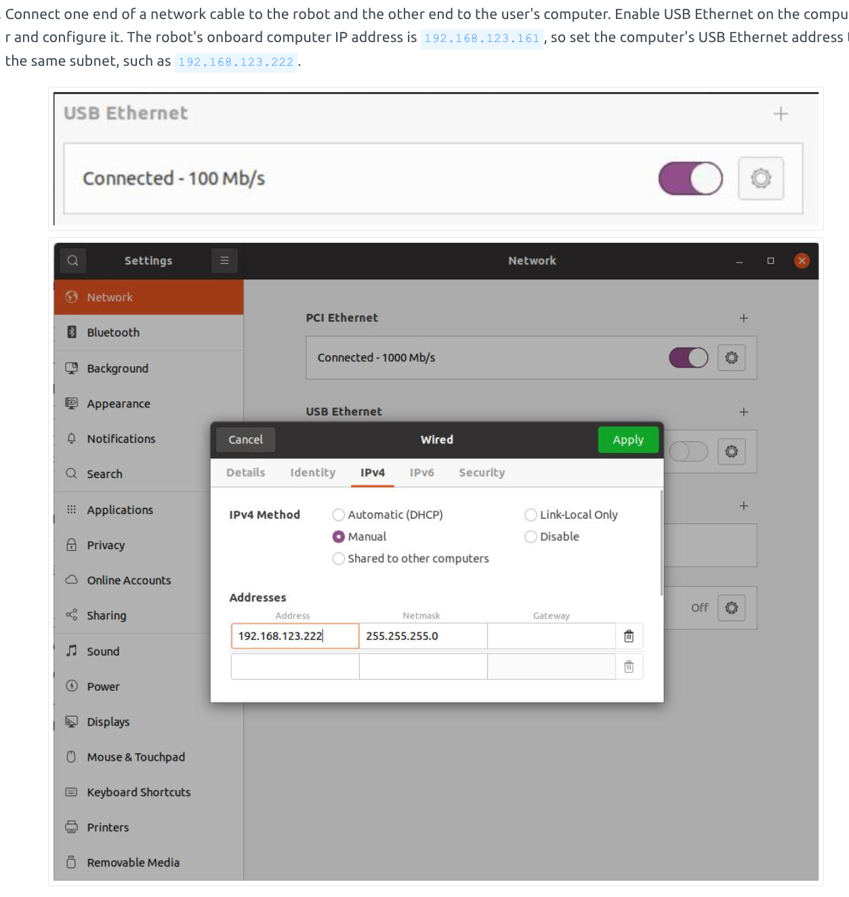

# humanoid_amp_mjlab

## Overview

`humanoid_amp_mjlab` is a reinforcement learning codebase built on MJLab for AMP-based Unitree G1 humanoid locomotion.

## Installation
**Conda environment**

```bash
conda create -n mjlab python=3.11
conda activate mjlab
```

**Install dependencies**
```bash
sudo apt install -y libyaml-cpp-dev libboost-all-dev libeigen3-dev libspdlog-dev libfmt-dev
```

**Install humanoid_amp_mjlab**
```bash
git clone https://github.com/yhx1203/humanoid_amp_mjlab
```

```bash
cd humanoid_amp_mjlab
pip install -e .
```


## Training

You can browse the motion set before training.

```bash
python scripts/view_csv_in_mujoco.py src/assets/motions/g1_seed/arc_walk_left_loop_001__A037.csv \
  --once 
```



```bash
python scripts/train.py Unitree-G1-AMP-Flat \
  --env.scene.num-envs 4096 \
  --agent.run-name amp_g1_seed \
  --agent.upload-model False
```

## Evaluate
```bash
python scripts/play.py Unitree-G1-AMP-Flat \
  --checkpoint-file logs/rsl_rl/g1_amp_walking/amp_seed/model_3200.pt \
  --num-envs 1 \
  --viewer viser
```


## Sim2sim

**Preparation**

[unitree_sdk2_python](https://github.com/unitreerobotics/unitree_sdk2_python)

```bash
conda activate mjlab

cd ~
sudo apt install python3-pip
git clone https://github.com/unitreerobotics/unitree_sdk2_python.git
cd unitree_sdk2_python
pip3 install -e .
```

### Gamepad

**Terminal 1**

```bash
cd humanoid_amp_mjlab
conda activate mjlab
python deploy/amp/sim2sim/g1_mjlab_simulator.py \
  --joystick \
  --joystick-type xbox \
  --joystick-device 0
```

**Terminal 2**
```bash
cd humanoid_amp_mjlab
conda activate mjlab

python deploy/amp/sim2sim/g1_amp_sim2sim.py \
  --policy-file logs/rsl_rl/g1_amp_walking/amp_seed/policy.onnx \
  --wireless 
```


### Fixed Velocity Command

**Terminal 1**

```bash
cd humanoid_amp_mjlab
conda activate mjlab
python deploy/amp/sim2sim/g1_mjlab_simulator.py
```

**Terminal 2**
```bash
cd humanoid_amp_mjlab
conda activate mjlab

python deploy/amp/sim2sim/g1_amp_sim2sim.py \
  --policy-file logs/rsl_rl/g1_amp_walking/amp_seed/policy.onnx \
  --cmd-x 0.6 \
  --cmd-y 0.15 \
  --cmd-yaw 0.3
```

## Sim2real

**Preparation**

connect g1



```bash
#validate
ping 192.168.123.161
```


Use `ifconfig` to find the Ethernet interface on the `192.168.123.*` subnet.
Replace `enp3s0` below with that interface name.

```bash
cd humanoid_amp_mjlab
conda activate mjlab

python deploy/amp/sim2real/g1_amp_sim2real.py \
  --policy-file logs/rsl_rl/g1_amp_walking/amp_seed/policy.onnx \
  --network-interface enp3s0 \
  --acknowledge-risk
```

## Robot Operation

1. Press **START** once.

2. Confirm that:
   - The robot is standing normally.
   - Both feet are in contact with the ground.
   - The safety tether is still attached.

3. Press **A** once to start the policy.

### Controller Mapping

- **Left stick up/down:** Move forward/backward
- **Left stick left/right:** Strafe left/right
- **Right stick left/right:** Turn left/right

### Stop the Policy

Press **B** to send damping commands for approximately 1 second.  

## Acknowledgements

This project builds upon and benefits from the following open-source repositories:

- [mjlab](https://github.com/mujocolab/mjlab)
- [unitree_rl_mjlab](https://github.com/unitreerobotics/unitree_rl_mjlab)
- [TienKung-Lab](https://github.com/Open-X-Humanoid/TienKung-Lab)
- [unitree_mujoco](https://github.com/unitreerobotics/unitree_mujoco)
- [bones-studio](https://huggingface.co/datasets/bones-studio/seed)


 
